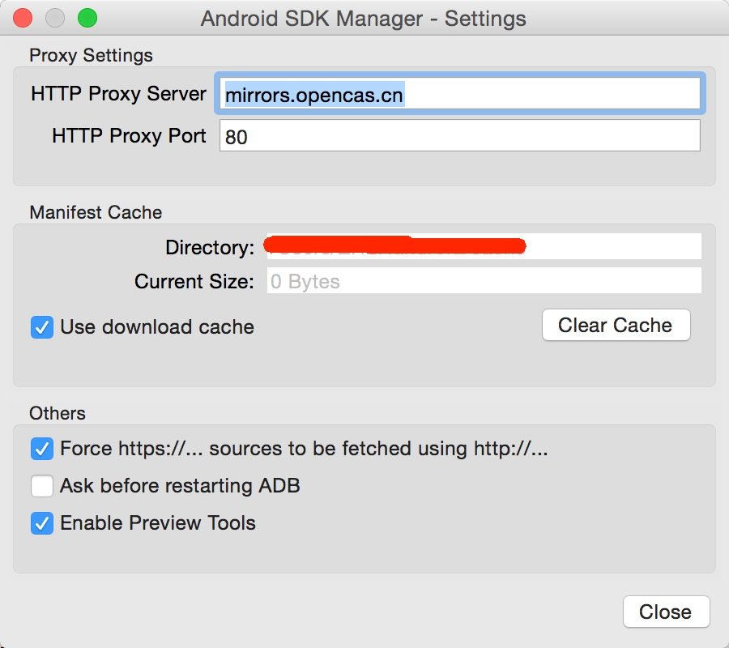
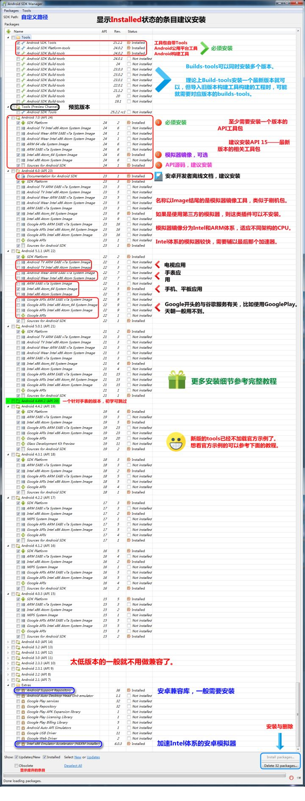
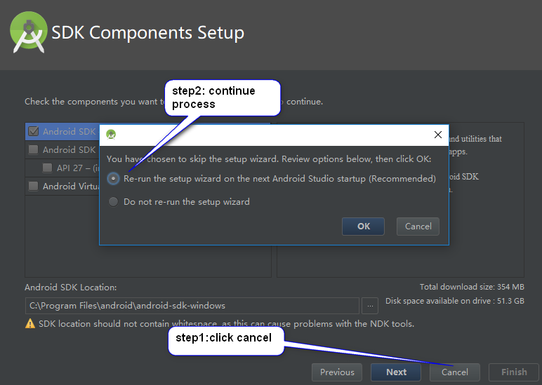
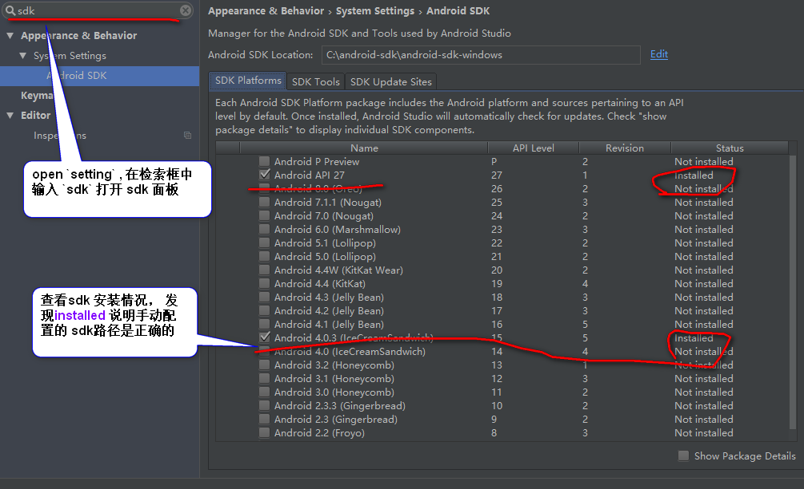

# android development environment config

## android emulator genymotion

* download personal free verision： https://www.genymotion.com/fun-zone/

* android studio extension: genymotion

## java evironment 

> new cordova need jdk 1.8 or above

* download jdk1.7 and jre7 from baidu disk

* config global environment

> https://jingyan.baidu.com/article/6dad5075d1dc40a123e36ea3.html


## android sdk manager

> https://github.com/inferjay/AndroidDevTools

* download sdk manager

> https://dl.google.com/android/android-sdk_r24.4.1-windows.zip?utm_source=androiddevtools&utm_medium=website

* install sdk manager 

> UnZip the file in any folder, 但要特别的注意解压的文件夹，的路径中，不能包含有空格（如 ： C:\Program Files\ 路径中就包含有一个空格路径，直接导致，后面的安装 功亏一篑）

> Error: Your project location contains whitespace. This can cause problem on some plateform and is not recommended


* config sdk manager

    + 郑州大学开源镜像站: `mirrors.zzu.edu.cn`  端口： `80`

    + 启动 Android SDK Manager ，打开主界面，依次选择『Tools』、『Options...』，弹出『Android SDK Manager - Settings』窗口；

    + 在『Android SDK Manager - Settings』窗口中，在『HTTP Proxy Server』和『HTTP Proxy Port』输入框内填入上面镜像服务器地址(不包含http://，如下图)和端口，并且选中『Force https://... sources to be fetched using http://...』复选框。设置完成后单击『Close』按钮关闭『Android SDK Manager - Settings』窗口返回到主界面；

    + 依次选择『Packages』、『Reload』。

    + 身体是枷锁，红尘是牢笼；



* necessary downloading 



## android API

* download API with sdk manager

* select appropriate API version

> https://pointdeveloper.com/build-ionic-2-cordova-apps-specific-platform-version/

> API 15

* config global environment

    + variable： ANDROID_HOME
    + path: %ANDROID_HOME%\platform-tools
    + path: %ANDROID_HOME%\tools

## android gradle


## android studio

### config the android sdk manually

* skip the SDK components setup panel



* config the SDK path 
    + File -- other settings - default project structure  打开 config panel
    + 在 Android SDK location 中 打开资源管理器  选择 sdk 目录
    + 目标目录是 (SDK Manager.exe 执行文件所在的路径) 

* sdk的路径设置完成之后，可以直接进入到了setting的设置界面中，然后在进行选中Android sdk的，查看sdk的路径是否正确。




* android studio default path

```bash
SDK路径              C:\Users\Administrator\AppData\Local\Android\sdk

软件安装路径       C:\Program Files\Android\Android Studio

默认工程目录       C:\Users\Administrator\AndroidstudioProjects

Gradle插件目录     C:\Users\Administrator\.gradle\wrapper\dists\gradle-1.9-all\3jdgemv0iv8uqohg3kcp2o88r1 目录下
```

### android studio ERROR

* Android Studio: “Please select Android SDK”
    + https://stackoverflow.com/questions/34353220/android-studio-please-select-android-sdk
    + solution is run 'Sync Project with Gradle Files'  Tools -> Android -> Sync Project with Gradle Files 


## select appropriate ionic android version

### for  android 

> 文档解释 ： https://developer.android.com/guide/topics/manifest/uses-sdk-element.html

> cordova 的很多配置，除了在官网文档上面找之外，还应去android 的文档里面找，配置的目的都是相同的，先后后者解释的更为详细一点；

*  if you run the build command, your app will be built for the default target for the CLI version of Cordova. For each version of the Cordova CLI the default build target is different. As a result, it becomes necessary to know how you can target the platform version of your choice.

```xml
<!-- config.xml 中 -->

<preference name="android-minSdkVersion" value="16"/>

<!-- This will build an app that will be supported by an Android device which has to have Android API-19 KitKat (4.4) installed at the least. This means that devices running latter version of the Android will also be able to run the app. It is a good practice to have a minSdkVersion set. -->

	
<preference name="android-maxSdkVersion" value="16"/>

<preference name="android-targetSdkVersion" value="16"/>

```

### for ios

```xml

<preference name="deployment-target" value="7.0" />

```


### full config file

```xml
<?xml version='1.0' encoding='utf-8'?>
<widget id="io.cordova.hellocordova" version="0.0.1" xmlns="http://www.w3.org/ns/widgets" xmlns:cdv="http://cordova.apache.org/ns/1.0">
    <name>HelloCordova</name>
    <description>
        A sample Apache Cordova application that responds to the deviceready event.
    </description>
    <author email="dev@cordova.apache.org" href="http://cordova.io">
        Apache Cordova Team
    </author>
    <content src="index.html" />
    <plugin name="cordova-plugin-whitelist" spec="1" />
    <access origin="*" />
    <allow-intent href="http://*/*" />
    <allow-intent href="https://*/*" />
    <allow-intent href="tel:*" />
    <allow-intent href="sms:*" />
    <allow-intent href="mailto:*" />
    <allow-intent href="geo:*" />
 
  <preference name="android-minSdkVersion" value="16"/>
  <preference name="android-targetSdkVersion" value="16"/>
  <preference name="android-maxSdkVersion" value="16"/>
 
  <preference name="deployment-target" value="7.0" />
 
    <platform name="android">
        <allow-intent href="market:*" />
    </platform>
    <platform name="ios">
        <allow-intent href="itms:*" />
        <allow-intent href="itms-apps:*" />
    </platform>
</widget>

```

## spec target cordova platform version

You should be able to see all the versions of platforms installed in your project with:

```bash
cordova platform list
```
Then you can remove the current version with:

```bash
cordova platform remove android
```

And install the version you want/need with: (in my case 6.1.1)

```bash
cordova platform add android@6.1.1
```

查看安装的cordova 插件

```bash
ionic cordova plugin list
```


Source: cordova.apache.org documentation


###  ionic build android时gradle错误

* 报错内容 

```bash
BUILD FAILED

Total time: 27.317 secs
* What went wrong:
A problem occurred configuring root project 'android'.
> Could not resolve all dependencies for configuration ':classpath'.
   > Could not resolve com.android.tools.build:gradle:1.5.0.
     Required by:
         :android:unspecified
      > Could not GET 'https://repo1.maven.org/maven2/com/android/tools/build/gradle/1.5.0/gradle-1.5.0.pom'.
         > Connection to https://repo1.maven.org refused

* Try:
Run with --stacktrace option to get the stack trace. Run with --info or --debug option to get more log output.
Error: Error code 1 for command: cmd with args: /s,/c,"D:\gitrepo\private\bitbucket\mfewordcard2\platforms\android\gradlew cdvBuil
dDebug -b D:\gitrepo\private\bitbucket\mfewordcard2\platforms\android\build.gradle -Dorg.gradle.daemon=true -Pandroid.useDeprecate
dNdk=true"

```

* solution

> 在 `ionic platform add android` 之后，在 `ionic build android` 之前，请手工修改 `<Project-dir>\platforms\android`目录 和 `<Project-dir>\platforms\android\CordovaLib` 目录下的 `build.gradle`文件，把`mavenCentral()`改成 `jcenter {url "http://jcenter.bintray.com/"}`

### 手动设置 ionic 的 gradle 路径

https://blog.csdn.net/yanzisu_congcong/article/details/78020056


### 应同时去修改 AndroidManifest.xml 的配置文件对应的版本

uses-sdk:minSdkVersion 14 cannot be smaller than version 16 declared in library [:CordovaLib] C:\Users\lhx10\Desktop\ionic-project\oppo\platforms\android\CordovaLib\build\intermediates\manifests\full\debug\AndroidManifest.xml as the library might be using APIs not available in 14

### 插件的版本 也会对SDK 的版本支持情况 造成影响，需要查看一下相关的 release

